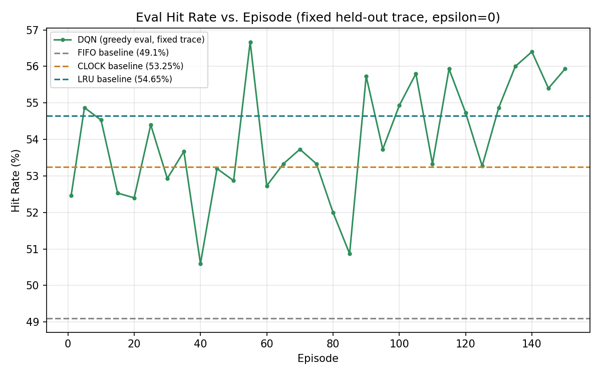
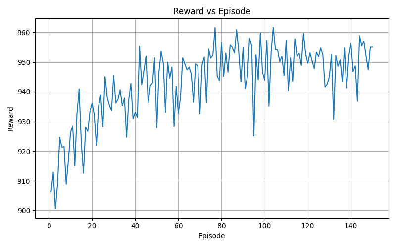
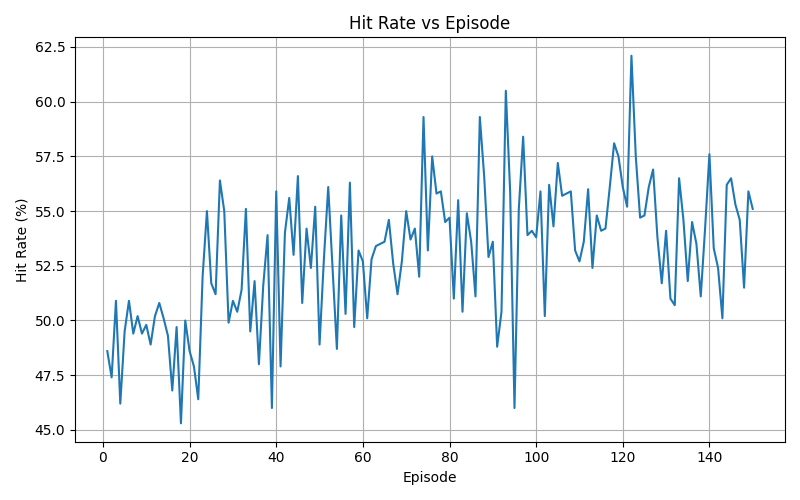
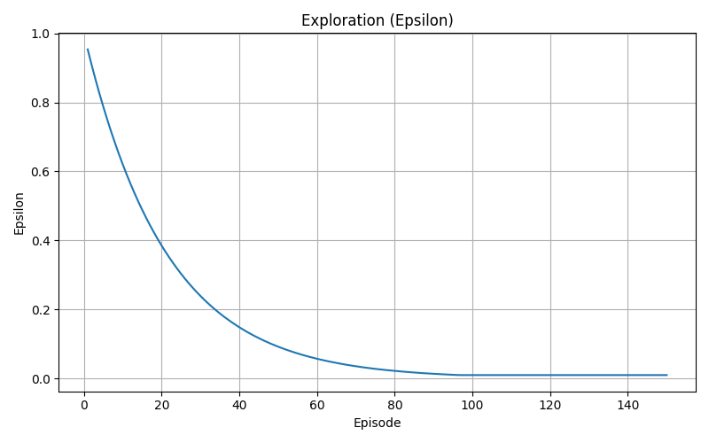
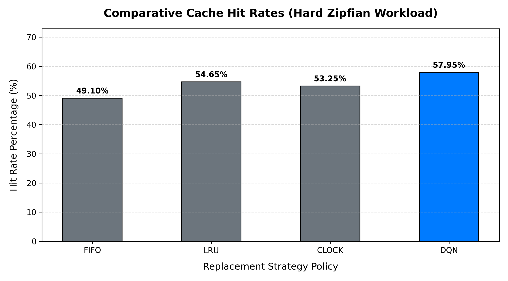

# RL_MemAI — Cache Replacement with Deep Reinforcement Learning

**A Double DQN learns a cache-eviction policy from scratch and is benchmarked
against three classical algorithms (FIFO, LRU, CLOCK) on skewed, realistic
access patterns — with the full debugging and validation process documented
below, since there's no live dashboard to demo this with.**

> **TL;DR:** Started from a project with two hidden bugs that made it look
> like it worked when it didn't. Found both, fixed both, tuned the result
> with Optuna, then stress-tested the win across 8 independent traces instead
> of trusting one lucky number. Final, honestly-reported result: **the
> trained agent beats LRU on 6 of 8 held-out traces** (mean hit rate 55.6% vs.
> LRU's 54.4%), and loses narrowly on the other 2. Full story below.

---

## Table of contents
1. [What this project does](#1-what-this-project-does)
2. [Architecture](#2-architecture)
3. [The MDP: state, action, reward](#3-the-mdp-state-action-reward)
4. [The engineering journey — two bugs, and how they were found](#4-the-engineering-journey--two-bugs-and-how-they-were-found)
5. [Hyperparameter tuning with Optuna](#5-hyperparameter-tuning-with-optuna)
6. [Results](#6-results)
7. [Honest limitations — what this does *not* show](#7-honest-limitations--what-this-does-not-show)
8. [Why isn't this just used in production caches?](#8-why-isnt-this-just-used-in-production-caches)
9. [Project structure](#9-project-structure)
10. [Running it](#10-running-it)
11. [Skills this project demonstrates](#11-skills-this-project-demonstrates)

---

## 1. What this project does

Cache eviction is normally handled by a fixed heuristic: FIFO evicts the
oldest entry, LRU evicts the least-recently-used one, CLOCK approximates LRU
cheaply with a circular buffer. This project instead treats eviction as a
**sequential decision problem**: an agent watches the cache fill up under a
skewed (Zipfian) access pattern and, every time it needs to evict something,
chooses *which slot* to evict — trained with a Double Deep Q-Network to
maximize long-run hit rate.

The interesting design choice is *how* the agent is taught: rather than a
sparse hit/miss signal, training rewards are shaped using **Belady's
offline-optimal algorithm** as a coach — the agent is told how good or bad
each eviction was by comparing it to what the *optimal* offline algorithm
would have done, using knowledge of the future access sequence. This is only
valid during training (the full trace is available in advance); at
inference time the trained policy sees none of that — it only ever sees the
current cache state, just like a real classical policy would.

This is not a novel idea invented here — it's the same core technique behind
Meta and Princeton's **Learning Relaxed Belady (LRB)**, published at NSDI
2020, which used an approximation of Belady's algorithm to reduce WAN traffic
by 5–24% in real production CDN traces. This project is a small-scale,
from-scratch reproduction of that idea, plus the debugging story of getting
it to actually work.

---

## 2. Architecture


**Pipeline, left to right / top to bottom:** a `WorkloadGenerator` produces a
page-access trace (Zipfian-distributed — a small number of "hot" pages get
most of the traffic, which is realistic for real memory/cache access
patterns) → the same trace drives both the custom `CacheEnv` (a Gymnasium
environment) and the classical baselines, so every policy is compared on
identical input → `CacheEnv` turns the DQN agent's eviction choices into
reward → the `DQNAgent` (online network + target network, replay memory,
ε-greedy exploration) learns from that reward stream → `metrics/benchmark.py`
and `multi_trace_benchmark.py` replay held-out traces through the trained
agent and the three baselines side by side → `plots/*.py` turns the logs into
the charts in this document. `main.py` runs the whole pipeline end to end in
one command.

---

## 3. The MDP: state, action, reward

| Component | Definition |
|---|---|
| **State** | For each of the 32 cache slots: `[page_id, access_frequency, recency]`, normalized to comparable ranges (empty slots padded), plus the incoming page id. |
| **Action** | `Discrete(32)` — which cache slot to evict. Only consulted on a miss when the cache is full. |
| **Reward** | `+1` on a hit · `+0.1` on a miss with a free slot · on a full-cache miss, a reward derived from **Belady's look-ahead distance** for the evicted page (evicting a page that won't be needed for a long time is rewarded; evicting one needed again soon is penalized). |

**Network:** a 4-layer MLP (`128 → 128 → 64 → action_dim`), trained as a
**Double DQN** — the online network selects the next action, the target
network evaluates it, which reduces the value-overestimation bias that
plagues vanilla DQN. Target network updates are **soft (Polyak averaging)**
rather than periodic hard copies (see §4 for why that mattered).

---

## 4. The engineering journey — two bugs, and how they were found

This is the part most worth reading if you only read one section. The
original project *looked* like it worked — it printed a 97–99% hit rate
during training — and that number was wrong in a way that a casual read of
the code would not catch.

### Bug #1: the hit-rate metric was measuring the wrong thing

The training loop decided whether a step was a "hit" by checking **whether
the reward was positive**:

```python
if not is_hit and reward > 0:
    is_hit = True
```

This is a natural-looking shortcut, but it's wrong: reward is a *shaped*
training signal, not a hit/miss indicator. A miss into a free cache slot
scores `+1` (positive!). A full-cache miss can also score positive, if the
evicted page happened to be a good eviction by the Belady-distance measure.
Both of those are misses. The heuristic counted them as hits.

**How it was caught:** by computing the *true* hit rate directly from the
environment's own `hits`/`misses` counters (which were correct the whole
time — the bug was only in how the training loop was *logging* the metric,
not in the environment itself) and comparing it to what the training log
printed. The gap was enormous: **97–99% logged vs. ~45–55% actual.**

**Fix:** read `env.hits` / `env.misses` directly. One-line conceptual fix,
but it invalidated every training-time metric the original project had ever
reported.

### Bug #2: fixing #1 exposed that training was actually diverging

Once the hit-rate metric was honest, a second problem became visible: the
training loss wasn't converging — it was climbing, from ~14 to ~77 over 150
episodes. That's the signature of an unstable value function, not a learning
one.

**Root cause, diagnosed from first principles:** the discount factor was
`gamma=0.99`, and the reward per step averaged roughly 5–6 (mixing hits,
free-slot misses, and the Belady-shaped term). The theoretical scale of the
Q-values the network has to fit is `reward / (1 - gamma)` — at `gamma=0.99`
that's **~550**. Asking an unnormalized-input network to fit targets on the
order of 550, using plain MSE loss (which squares errors — so a bit of noise
at that scale produces enormous gradients), with the target network only
hard-copied every 10,000 steps, is a recipe for exactly the instability
observed.

**Fix, four changes applied together (none alone was sufficient):**
- `gamma`: `0.99 → 0.9` — shrinks the theoretical Q-scale to ~55
- Loss: `MSELoss → SmoothL1Loss` (Huber) — caps the influence of reward outliers instead of squaring them
- Target updates: hard copy every 10 episodes → **soft (Polyak) update every learning step**
- **State normalization**: raw `page_id` (0–500) and `recency` (0–1000) were feeding a randomly-initialized network on wildly different scales than the small frequency values — normalized all three to comparable ranges

**Result:** training loss now decreases monotonically (0.26 → 0.02 over 150
episodes) instead of diverging. This was the precondition for everything
that follows — a diverging loss makes hyperparameter tuning meaningless,
since you'd just be tuning how *fast* something breaks.

### A methodology fix alongside the bug fixes

The original training loop had no way to tell if the policy was actually
improving — its one hit-rate number was measured on a **freshly randomized
workload every episode**, so it was too noisy to show a trend either way.
Added a second metric, `EvalHitRate`: every 5 episodes, the policy is
evaluated greedily (no exploration) on one **fixed, seeded** held-out trace.
That's the number that should trend upward if learning is real — and,
post-fix, it does:



---

## 5. Hyperparameter tuning with Optuna

With training stabilized, a proper hyperparameter search became worth doing.
`tune.py` runs an Optuna study (TPE sampler + median pruner) over `gamma`,
learning rate, `tau` (soft-update rate), `epsilon_decay`, and `batch_size`.
Each trial trains on a shorter proxy budget (25 episodes, not the full 150)
using **the same fixed set of workloads across every trial**, so differences
in score reflect the hyperparameters, not a lucky workload draw — and each
trial is scored the same way as `EvalHitRate` above: greedy evaluation on one
fixed held-out trace. The study is resumable (SQLite-backed), so it doesn't
need one long uninterrupted session.

25 trials found:

```json
{
  "gamma": 0.899,
  "lr": 2.56e-05,
  "tau": 0.00176,
  "epsilon_decay": 0.9535,
  "batch_size": 128
}
```

Worth being direct about the limits of this: with a 25-episode proxy budget
and 25 trials, this is a search that narrows the space efficiently — it is
not an exhaustive or rigorous sweep, and shouldn't be described as finding a
global optimum.

---

## 6. Results

### Training dynamics

| Reward vs. episode | Hit rate vs. episode (noisy, per-episode) | Epsilon decay |
|---|---|---|
|  |  |  |

### Benchmark — single held-out trace



| Policy | Hit Rate |
|---|---|
| FIFO | 46.40% |
| CLOCK | 50.90% |
| LRU | 52.65% |
| **DQN** | **56.45%** |

### Robustness — 8 independent held-out traces (no retraining)

A single trace can be a lucky draw, so the trained model (unchanged) was
re-evaluated against 8 more independently-drawn traces from the same
workload family:

| Policy | Mean | Std | Min | Max |
|---|---|---|---|---|
| FIFO | 48.19% | 1.41 | 45.00% | 50.20% |
| CLOCK | 52.54% | 1.27 | 49.75% | 54.50% |
| LRU | 54.36% | 1.30 | 51.40% | 55.95% |
| **DQN** | **55.62%** | 1.94 | 52.30% | 58.45% |

**DQN beat all three baselines on 6 of 8 traces**, and was narrowly
outperformed by LRU on the remaining 2 (53.70% vs. 54.70%, and 54.50% vs.
55.00%). The honest summary is "beats LRU on most held-out draws by roughly a
point on average," not "always wins" — and that's the claim this project
actually makes, not a stronger one.

---

## 7. Honest limitations — what this does *not* show

- **One workload family.** Everything above is Zipfian with a single skew
  parameter (`alpha=1.1`, 500 pages). There's no evidence yet this
  generalizes to a different skew, a scan-heavy pattern, or a real trace.
- **Toy scale.** 32 cache slots, 500 pages. Real caches are orders of
  magnitude larger.
- **Training-run variance not yet measured.** The 8-trace robustness check
  varies the *test* trace, holding the trained policy fixed. It does not yet
  show how much the *learned policy itself* varies across independent
  training runs (different seeds) — that would need 2–3 full retrains,
  flagged as follow-up work.
- **Inference cost not measured.** The benchmark only reports hit rate, never
  decision latency — which matters a lot in practice (see §8).

---

## 8. Why isn't this just used in production caches?

A fair question after a positive benchmark. Three compounding reasons real
systems mostly stick to classical heuristics:

1. **Inference latency.** A neural forward pass costs microseconds —
   irrelevant for a CDN cache making a few thousand decisions/sec, but
   disqualifying for CPU L1/L2/L3 caches or OS page tables, which decide in
   nanoseconds, billions of times/sec. (Meta's LRB, mentioned above, uses
   lightweight gradient-boosted trees rather than a deep network for exactly
   this reason — inference cost was a first-class constraint.)
2. **Predictability and drift.** LRU/CLOCK/ARC have no training data to go
   stale, and their worst-case behavior is well understood. A learned policy
   trained on one traffic period can silently degrade as patterns shift, and
   diagnosing why is harder than diagnosing a heuristic.
3. **The heuristics are already very good.** Modern non-ML policies (ARC,
   W-TinyLFU) get close to Belady-optimal on real workloads at O(1) cost —
   which is why even LRB's production numbers, against strong baselines, are
   a meaningful-but-not-dramatic improvement (5-24%) rather than a blowout.

---

## 9. Project structure

```
RL_MemAI/
├── main.py                    # train → benchmark → plots, end-to-end
├── tune.py                    # Optuna hyperparameter search (§5)
├── multi_trace_benchmark.py   # robustness check across held-out traces (§6)
├── requirements.txt
├── agent/
│   ├── agent.py                # DQNAgent: Double DQN, soft target updates, Huber loss
│   ├── network.py               # CacheQNetwork (4-layer MLP)
│   └── train.py                 # training loop: seeded, fixed-trace EvalHitRate, CSV logging
├── cache/
│   ├── base.py                  # CacheBase ABC
│   ├── cache_env.py             # Gymnasium CacheEnv: normalized state, scaled/oracle reward
│   └── fifo.py / lru.py / clock.py   # classical baselines
├── metrics/
│   └── benchmark.py             # DQN vs. FIFO/LRU/CLOCK, single trace
├── plots/
│   ├── generate_plots.py        # reward/hit-rate/epsilon curves
│   └── benchmark_plot.py        # baseline-vs-DQN bar chart
├── workload/
│   └── generator.py             # Zipfian / locality / mixed synthetic traces
└── assets/                      # every image in this README
```

---

## 10. Running it

```bash
pip install -r requirements.txt

# full pipeline: train -> benchmark -> plots (~15 min on CPU)
python main.py

# optional: hyperparameter search before training
python tune.py --trials 25 --episodes 25
# -> writes best_hparams.json; copy values into the DQNAgent(...) call in agent/train.py

# optional: robustness check across multiple held-out traces (no retraining)
python multi_trace_benchmark.py --traces 8
```

`models/` and `logs/` are gitignored and regenerated by the commands above.

---

## 11. Skills this project demonstrates

- Designing a custom Gymnasium RL environment (state/action/reward design, reward shaping via an offline oracle)
- Double DQN implementation (online/target networks, soft target updates, experience replay)
- **Diagnosing training instability from first principles** (deriving the Q-value scale from `gamma` and reward magnitude, rather than guessing at hyperparameters)
- Catching a metric bug that was masking the real state of a system — the kind of bug that "looks like it's working"
- Hyperparameter optimization with Optuna (resumable studies, pruning, proxy objectives)
- Statistical validation discipline: not trusting a single benchmark number, testing across independent traces, and reporting a result that's honest about its limits (6/8, not "always wins")
- Technical writing: this document itself, as the primary artifact in place of a live demo
